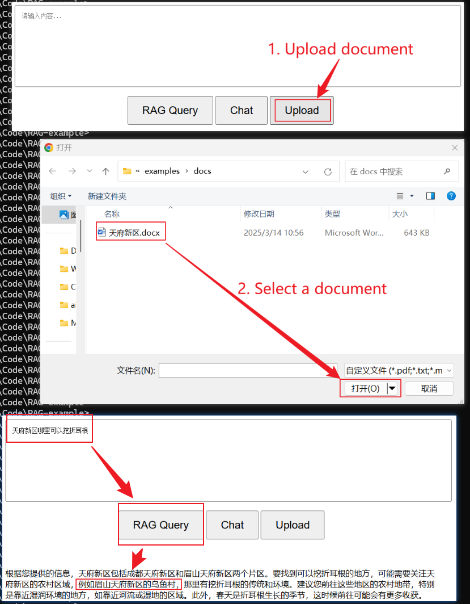

# RAG-example

A RAG application example for windows.

## Requirements

Python 3.11+, Windows 11

## Setup

### Auto Setup

You can just run *setup.bat* script to setup the full environment.

    setup.bat

### Manual Setup

You can also setup by manual with the following steps:

1. Install python 3.11.x

2. Create and activate virtual env:

        python -m venv venv
        venv\Scripts\activate.bat   # Run it in "Command Prompt" instead of PowerShell env

3. Install dependent packages

        pip install -r requirements.txt

4. Download *llama.cpp* binaries from: [llama-b4879-bin-win-avx2-x64.zip](https://github.com/ggml-org/llama.cpp/releases/download/b4879/llama-b4879-bin-win-avx2-x64.zip) and unzip it into directory *llama.cpp*

5. Download LLM GGUF model file, for example: [deepseek.gguf](https://huggingface.co/unsloth/DeepSeek-R1-Distill-Llama-8B-GGUF/resolve/main/DeepSeek-R1-Distill-Llama-8B-Q4_K_M.gguf)

6. Download embedding model file, for example: [embedding.gguf](https://huggingface.co/gaianet/Nomic-embed-text-v1.5-Embedding-GGUF/resolve/main/nomic-embed-text-v1.5.f16.gguf)

6. Start *llama.cpp* server to run LLM and embedding models, for example: 

        llama.cpp/llama-server.exe -m deepseek.gguf --port 8080
        llama.cpp/llama-server.exe -m embedding.gguf --embedding --ubatch-size 1024 --port 8081

7. Start *chroma* server:

        chroma run --port 8082

8. Start web server:

        python www\wsgi.py

9. Open example in browser: <http://localhost:5000>

## Example

